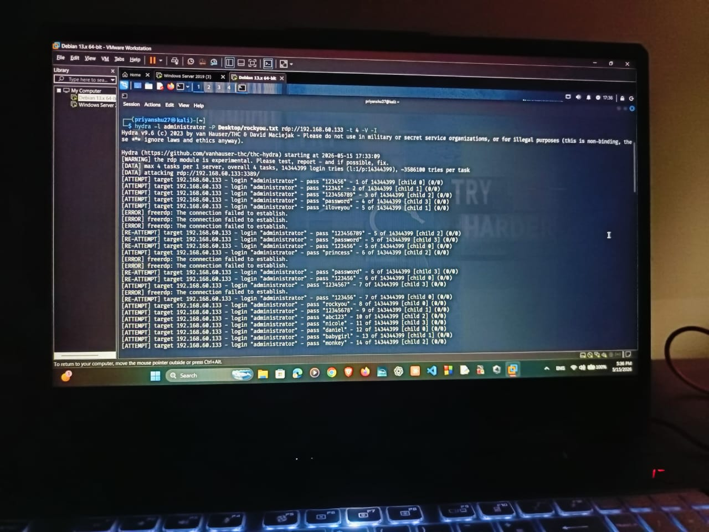
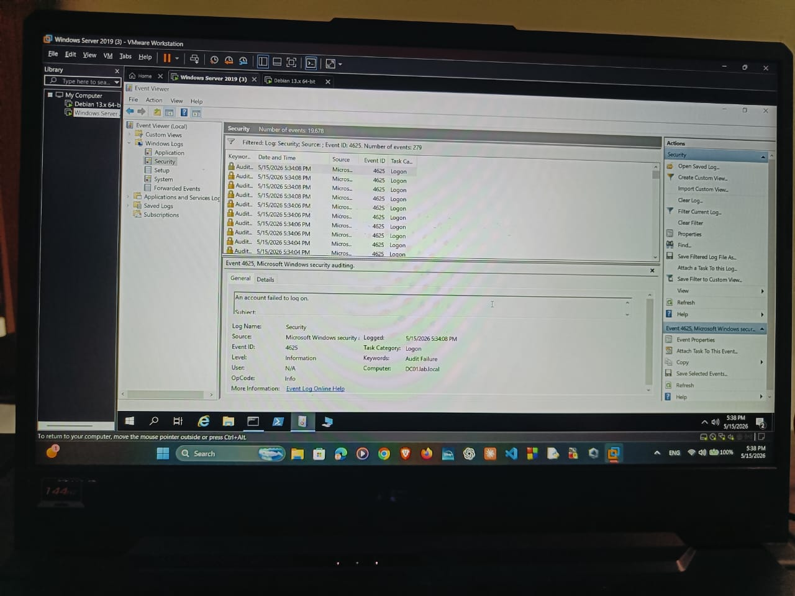
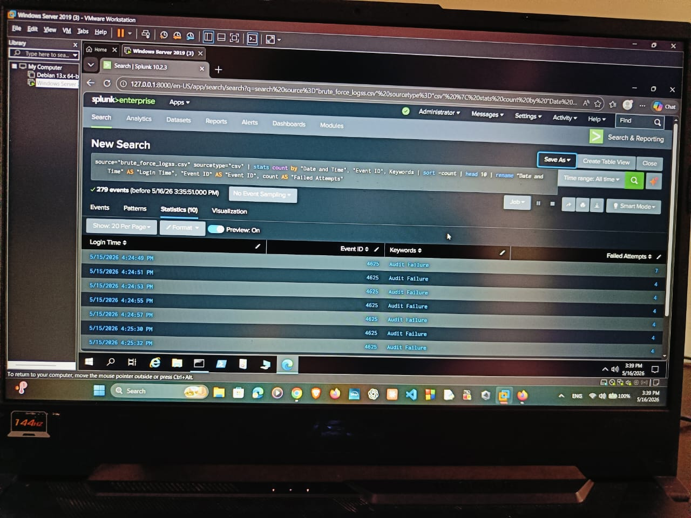
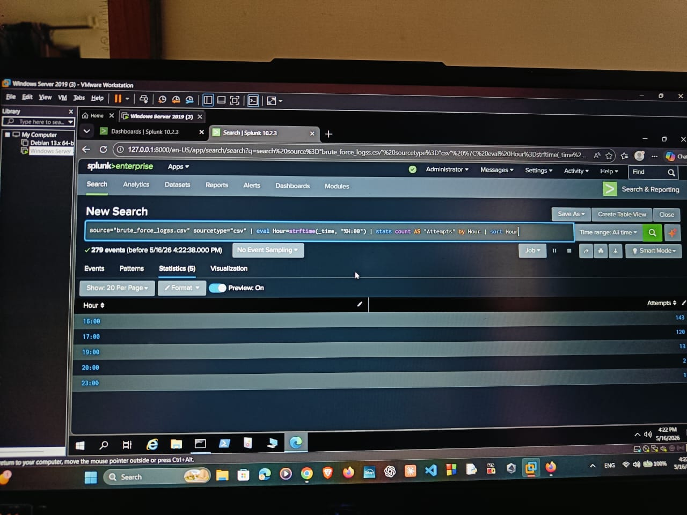
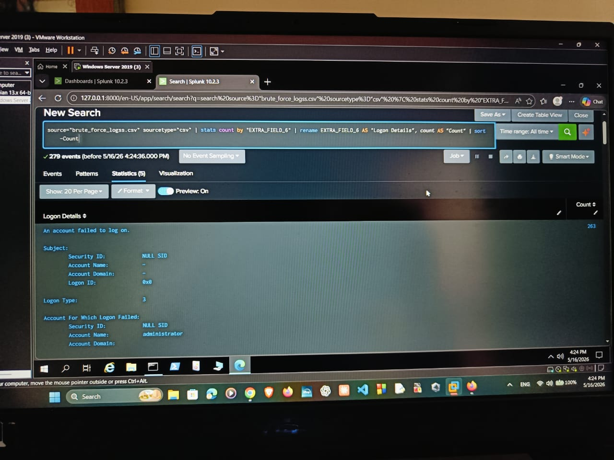
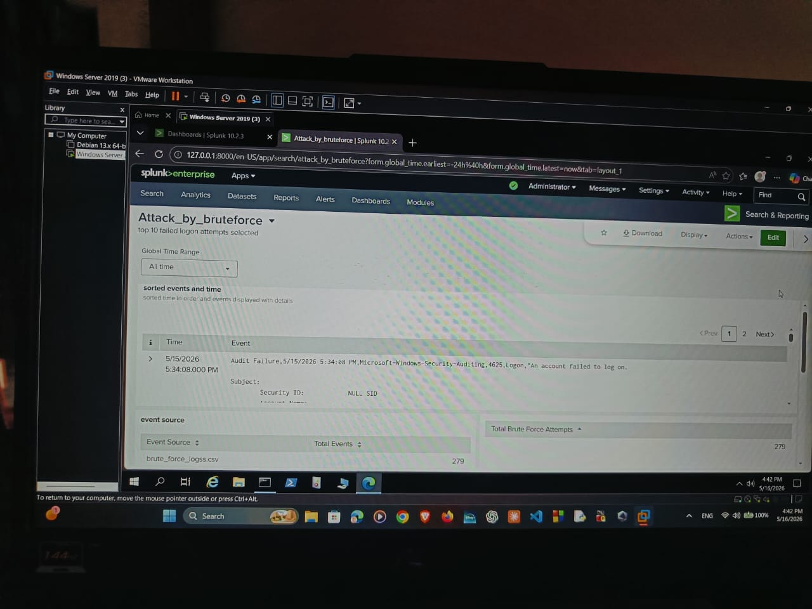
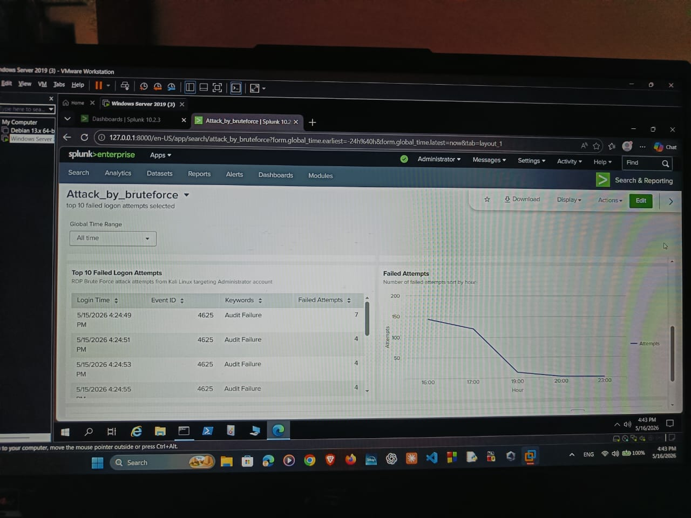

# 🔐 Splunk SOC Lab - Brute Force Detection

## 📌 Project Overview
This project simulates a brute-force attack and demonstrates how to detect it using Splunk.

The goal is to identify suspicious login activity by analyzing logs and creating detection queries and dashboards.

---

## Tools Used
- Splunk
- Windows Event viewer
- Hydra

---

## Attack Simulation
- Simulated brute-force login attempts using Hydra
- Generated multiple failed authentication logs
- Logs ingested into Splunk for analysis

---

## Detection & Analysis

### Key SPL Queries:
- Top 10 Failed Logon Attempts
- Failed Attempts Line Graph
- Sorted Events by Time and Event Code
- Total Brute Force Attempts

📁 All queries available here:  
`queries/spl-queries.md`

---

## Screenshots

### Brute Force Attack Simulation

### Event Logs

### SPL Query Results

### Dashboard Visualization

---

## Outcome
- Successfully detected brute-force attack patterns
- Built dashboard for visualization
- Gained hands-on experience in SOC-level log analysis

---

## Skills Demonstrated
- Log analysis
- Threat detection
- SPL (Splunk Processing Language)
- Dashboard creation
